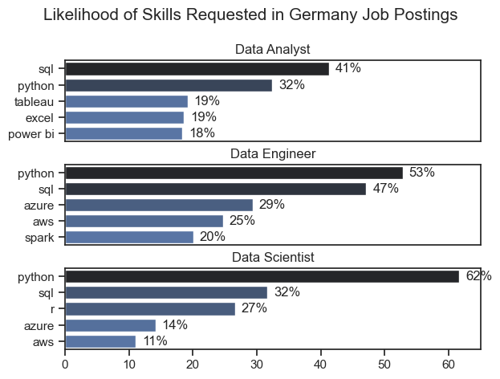
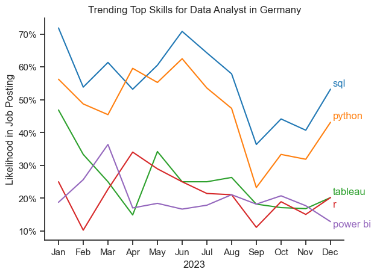
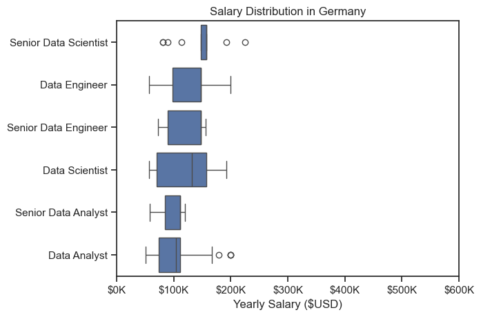
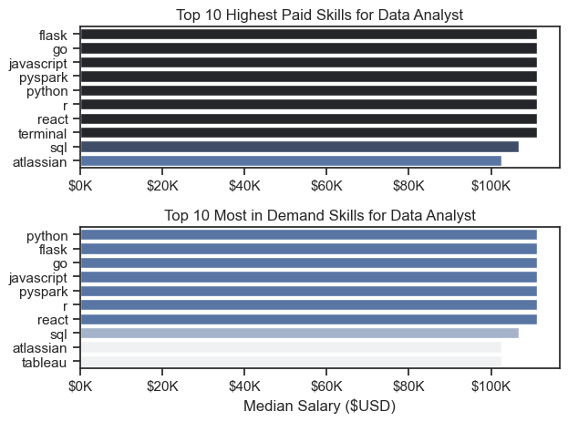
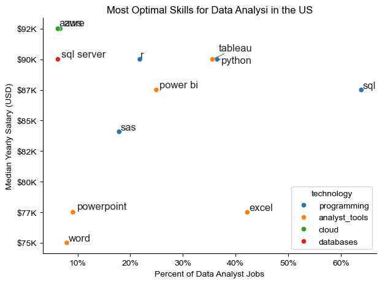

# The Analysis

## 1. What are the most demanded skills for the top 3 most popular data roles?

To find the most demanded skills for the top 3 most popular data roles. I filtered out those positions by which ones were the most popular, and got the top 5 skills for these top 3 roles. This query highlights the most popular job titles and their top skills, showing which skills I should pay attention to depending on the role I'm targeting.

View my notebook with detailed steps here: [2_Skills_Count.ipynb](3_Project/2_Skills_Count.ipynb)

### Visualize Data

```python
fig, ax = plt.subplots(len(job_titles), 1)

sns.set_theme(style = 'ticks')

for i, job_title in enumerate(job_titles):
    df_plot = df_skills_percent[df_skills_percent['job_title_short'] == job_title].head(5)
    sns.barplot(data = df_plot, x = 'skill_percent', y = 'job_skills', ax = ax[i], hue = 'skill_count', palette = 'dark:b_r')
    ax[i].set_title(job_title)
    ax[i].set_ylabel('')
    ax[i].set_xlabel('')
    ax[i].set_xlim(0,65)
    ax[i].get_legend().remove()

    for n, v in enumerate(df_plot['skill_percent']):
        ax[i].text(v + 1, n, f'{v:.0f}%', va = 'center')
    
    if i != len(job_titles) - 1:
        ax[i].set_xticks([])

fig.suptitle('Likelihood of Skills Requested in Germany Job Postings', fontsize = 15)
fig.tight_layout(h_pad = 0.5)
plt.show()
```

### Results


*Bar graph visualizing the salary for the top 3 data roles and their top 5 skills associated with each.*

### Insights

- Across Data Analyst, Data Engineer, and Data Scientist roles in Germany, SQL and Python consistently appear as the most in-demand skills. 
- Data Analysts rely heavily on business intelligence tools such as Tableau, Excel, and Power BI, reflecting a stronger focus on reporting and data visualization. 
- Data Engineers show the widest technical spread, with high demand for cloud platforms (Azure, AWS) and big-data technologies like Spark, indicating more infrastructure-oriented responsibilities. 
- Data Scientists emphasize programming and statistical analysis, with strong requirements for Python, SQL, and R. Overall, the chart highlights a clear pattern: while all roles share a foundation in SQL and Python, each job type branches into distinct toolsets aligned with its core tasks.

## 2. How are in-demand skills trending for Data Analysts?

To find how skills are trending in 2023 for Data Analysts, I filtered data analyst positions and grouped the skills by the month of the job postings. This got me the top 5 skills of data analysts by month, showing how popular skills were throughout 2023.

View my notebook with detailed steps here: [3_Skills_Trend](3_Project/3_Skills_Trend.ipynb).
*Bar graph visualizing the trending top skills for data analysts in the US in 2023.*

### Visualize Data

```python

sns.lineplot(data = df_plot, dashes=False, palette='tab10')
sns.set_theme(style='ticks')

from matplotlib.ticker import PercentFormatter
ax = plt.gca()
ax.yaxis.set_major_formatter(PercentFormatter())

plt.show()

```

### Results

  
*Bar graph visualizing the trending top skills for data analysts in Germany in 2023.*

### Insights:
1. SQL stays on top all year.
It’s consistently the most requested skill for Data Analysts in Germany, even though it dips a bit late summer.

2. Python is strong but more volatile.
It rises in spring/early summer, drops sharply in September, then picks up again toward the end of the year. Still clearly the second-most important skill.

3. Tableau trends downward.
It starts fairly high but gradually declines through the year. This might signal a shift toward other visualization tools or more emphasis on coding-based skills.

4. R keeps a moderate but steady presence.
It has ups and downs, but stays mid-range. Some companies still want it, but it’s far less central than SQL/Python.

5. Power BI stays low and stable.
It’s the least requested of the five but remains consistent. Likely more dependent on specific company ecosystems than industry-wide demand.

## 3. How well do jobs and skills pay for Data Analysts?

To identify the highest-paying roles and skills, I only got jobs in the United States and looked at their median salary. But first I looked at the salary distributions of common data jobs like Data Scientist, Data Engineer, and Data Analyst, to get an idea of which jobs are paid the most. 

View my notebook with detailed steps here: [4_Salary_Analysis](4_Salary_Analysis.ipynb).

#### Visualize Data 

```python
sns.boxplot(data=df_US_top6, x='salary_year_avg', y='job_title_short', order=job_order)

ticks_x = plt.FuncFormatter(lambda y, pos: f'${int(y/1000)}K')
plt.gca().xaxis.set_major_formatter(ticks_x)
plt.show()

```

#### Results

  
*Box plot visualizing the salary distributions for the top 6 data job titles.*

#### Insights

- There's a significant variation in salary ranges across different job titles. Senior Data Scientist positions tend to have the highest salary potential, indicating the high value placed on advanced data skills and experience in the industry.

- The median salaries increase with the seniority and specialization of the roles. Senior Data Scientist, Senior Data Engineer have higher median salaries compared with Senior Data Analyst roles. 

### Highest Paid & Most Demanded Skills for Data Analysts

Next, I narrowed my analysis and focused only on data analyst roles. I looked at the highest-paid skills and the most in-demand skills. I used two bar charts to showcase these.

#### Visualize Data

```python

fig, ax = plt.subplots(2, 1)  

# Top 10 Highest Paid Skills for Data Analysts
sns.barplot(data = df_DA_top_pay, x = 'median', y = df_DA_top_pay.index, ax = ax[0], hue = 'median', palette = 'dark:b_r')

# Top 10 Most In-Demand Skills for Data Analystsr')
sns.barplot(data = top_skills, x = 'median', y = top_skills.index, ax = ax[1], hue = 'median', palette = 'light:b')

plt.show()

```

#### Results
Here's the breakdown of the highest-paid & most in-demand skills for data analysts in the US:


*Two separate bar graphs visualizing the highest paid skills and most in-demand skills for data analysts in the US.*


#### Insights:

- The best-paid skills aren’t the most in-demand ones. Skills like flask, go, javascript, and pyspark show up at the top of the salary chart but lower in demand. These are more specialized, so companies pay more when they need them.

- Python sits in the sweet spot. It appears both highly paid and highly in demand, making it the strongest all-around skill for a Data Analyst.

- Tableau is in demand but not highly paid. It ranks in the top 10 most requested skills, but it sits at the bottom of the salary chart. Employers want it, but it doesn’t command premium salaries.

- SQL is essential but not as highly paid. SQL appears in both charts, showing stability and demand, but salaries tied to SQL aren’t as high as more niche technical skills like flask or javascript.

- Specialized engineering-leaning tools drive higher pay. Tools like pyspark, go, and flask suggest a crossover into data engineering and software development. When analysts use these, salaries go up.


## 4. What are the most optimal skills to learn for Data Analysts?

To identify the most optimal skills to learn ( the ones that are the highest paid and highest in demand) I calculated the percent of skill demand and the median salary of these skills. To easily identify which are the most optimal skills to learn. Due to low data on skills and jobs in Germany, the analysis was done on jobs in the US.

View my notebook with detailed steps here: [5_Optimal_Skills](3_Project/5_Optimal_Skills.ipynb).

#### Visualize Data

```python
from matplotlib.ticker import PercentFormatter

# Create a scatter plot
scatter = sns.scatterplot(
    data=df_DA_skills_tech_high_demand,
    x='skill_percent',
    y='median_salary',
    hue='technology',  # Color by technology
    palette='bright',  # Use a bright palette for distinct colors
    legend='full'  # Ensure the legend is shown
)
plt.show()

```

#### Results

  
*A scatter plot visualizing the most optimal skills (high paying & high demand) for data analysts in the US with color labels for technology.*

#### Insights:

- SQL is unbeatable in practicality. It has the highest demand (60%+) and still offers a strong salary, making it the safest and most valuable skill for Data Analysts in the US.

- Python + Tableau = high-value combo. Both sit in the 30–40% demand range with good salaries ($88–90K). These two together make you competitive in both analytics and visualization roles.

- Cloud skills (AWS, Azure) are high-paying but low-demand. They appear in under 10% of job postings, but salaries are the highest on the chart. Great for boosting earning potential if you want to stand out.

- R and Power BI are solid mid-tier options. They sit around 20–30% demand with mid-to-high salaries. Not must-haves, but definitely useful.

- Excel, Word, PowerPoint are high demand but low salary boosters. Excel especially appears in ~45% of jobs, but the salary attached to it is lower. They are baseline tools — expected, not premium.

- SAS is losing ground. Demand is dropping (around 20%) and salaries sit lower than Python/R. Good to know but not worth focusing on unless required.


# What I Learned

Throughout this project, I deepened my understanding of the data analyst job market and enhanced my technical skills in Python, especially in data manipulation and visualization. Here are a few specific things I learned:

- **Advanced Python Usage**: Utilizing libraries such as Pandas for data manipulation, Seaborn and Matplotlib for data visualization, and other libraries helped me perform complex data analysis tasks more efficiently.
- **Data Cleaning Importance**: I learned that thorough data cleaning and preparation are crucial before any analysis can be conducted, ensuring the accuracy of insights derived from the data.
- **Strategic Skill Analysis**: The project emphasized the importance of aligning one's skills with market demand. Understanding the relationship between skill demand, salary, and job availability allows for more strategic career planning in the tech industry.


# Insights

This project provided several general insights into the data job market for analysts:

- **Skill Demand and Salary Correlation**: There is a clear correlation between the demand for specific skills and the salaries these skills command. Advanced and specialized skills like Python and Oracle often lead to higher salaries.
- **Market Trends**: There are changing trends in skill demand, highlighting the dynamic nature of the data job market. Keeping up with these trends is essential for career growth in data analytics.
- **Economic Value of Skills**: Understanding which skills are both in-demand and well-compensated can guide data analysts in prioritizing learning to maximize their economic returns.


# Challenges I Faced

This project was not without its challenges, but it provided good learning opportunities:

- **Data Inconsistencies**: Handling missing or inconsistent data entries requires careful consideration and thorough data-cleaning techniques to ensure the integrity of the analysis.
- **Complex Data Visualization**: Designing effective visual representations of complex datasets was challenging but critical for conveying insights clearly and compellingly.
- **Balancing Breadth and Depth**: Deciding how deeply to dive into each analysis while maintaining a broad overview of the data landscape required constant balancing to ensure comprehensive coverage without getting lost in details.


# Conclusion

This exploration into the data analyst job market has been incredibly informative, highlighting the critical skills and trends that shape this evolving field. The insights I got enhance my understanding and provide actionable guidance for anyone looking to advance their career in data analytics. As the market continues to change, ongoing analysis will be essential to stay ahead in data analytics. This project is a good foundation for future explorations and underscores the importance of continuous learning and adaptation in the data field.